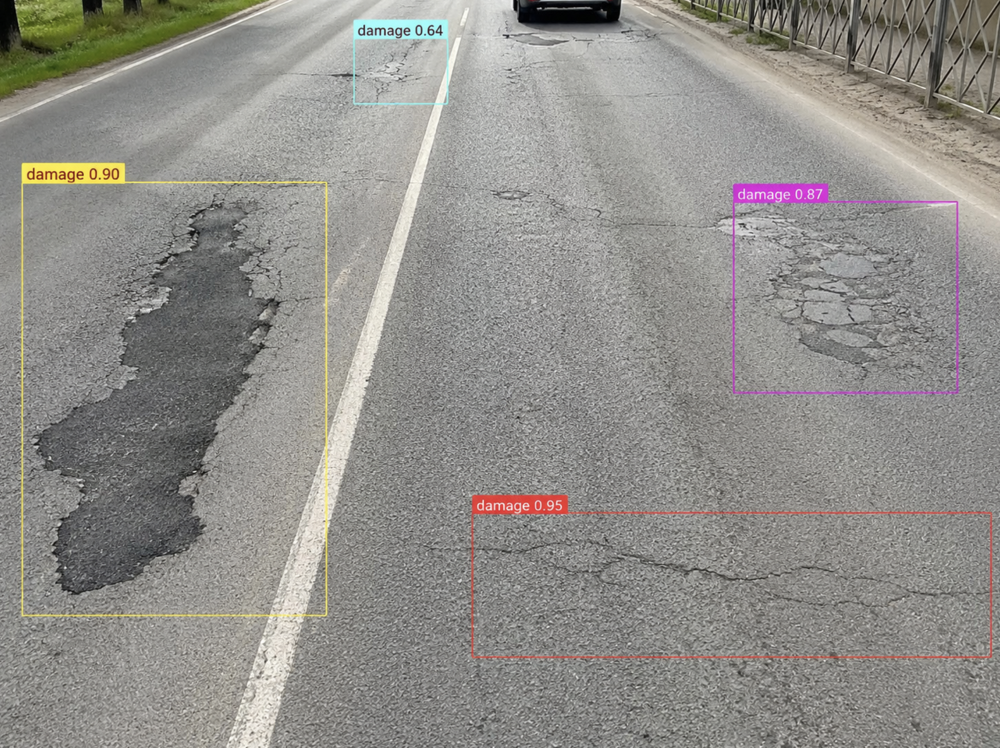
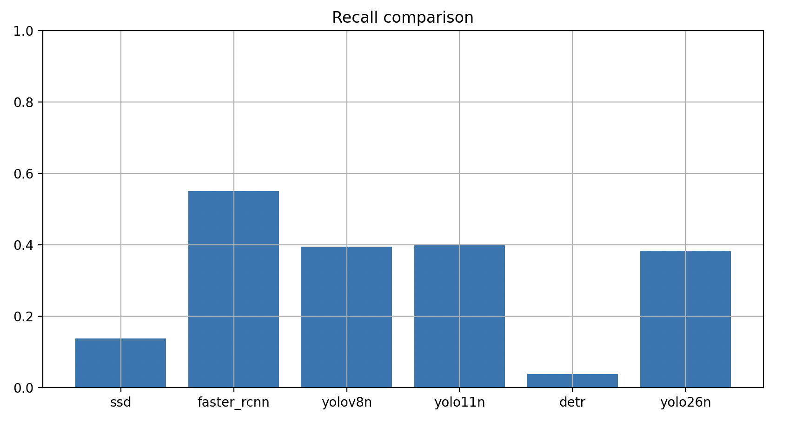
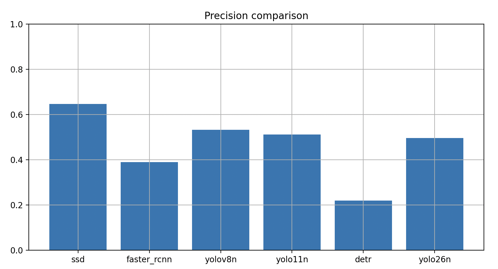
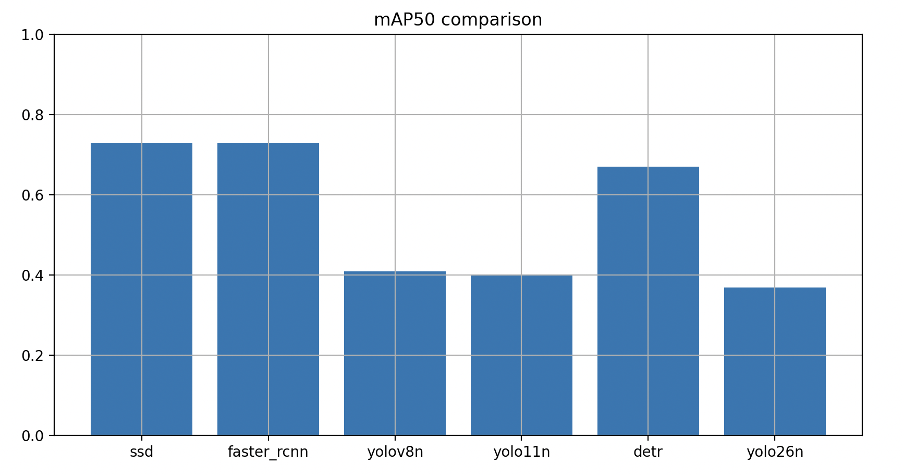

# Road Damage Project

---



---

**Dataset:** https://universe.roboflow.com/road-condition-detection-zr4jv/rdd2022-22jrg

## Сравнительный анализ моделей компьютерного зрения для обнаружения дефектов дорожного покрытия

### Описание проекта

Проект посвящён исследованию и сравнению современных моделей обнаружения объектов для автоматического выявления дефектов дорожного покрытия на изображениях.

**Целью работы** является определение наиболее эффективной модели для задачи обнаружения дефектов дорожного покрытия по изображениям.

Для достижения цели были решены следующие задачи:

1. Подготовка и анализ набора данных.
2. Реализация пайплайна обучения моделей.
3. Обучение шести архитектур обнаружения объектов.
4. Расчёт метрик качества.
5. Построение графиков обучения.
6. Сравнительный анализ результатов.
7. Формулировка практических рекомендаций по выбору модели.

---

## Используемый набор данных

Набор данных содержит изображения дорожного покрытия с размеченными дефектами.

Структура данных:
```text
data/
│└── raw/
││   ├── test/
││   ├── valid/
││   └── data.yaml
│└── processed/
```
Разметка выполнена в формате YOLO.

---

## Структура проекта

```text
RoadDamageProject/
├── configs/
│   └── default.yaml
├── data/
│   ├── raw/
│   └── processed/
├── src/
│   ├── dataset/
│   ├── models/
│   │   ├── yolov8n/
│   │   ├── yolov11n/
│   │   ├── yolo26/
│   │   ├── ssd/
│   │   ├── faster_rcnn/
│   │   └── detr/
│   ├── training/
│   ├── evaluation/
│   └── utils/
├── notebooks/
├── results/
│   ├── plots/
│   ├── logs/
│   └── metrics.json
├── main.py
├── requirements.txt
├── setup.py
└── README.md
```
---

## Используемые модели

**В рамках работы проведено обучение и сравнительный анализ шести моделей:**

* YOLOv8n
* YOLO11n
* YOLO26n
* SSD300 (VGG16)
* Faster R-CNN (ResNet-50 FPN)
* DETR (ResNet-50)

Все модели обучались на едином наборе данных дорожных дефектов в формате YOLO с одинаковыми условиями подготовки данных и последующей оценки качества.

---

## Обучение моделей

Для обеспечения воспроизводимости экспериментов использовались:

* фиксированное значение seed = 42;
* одинаковый набор данных;
* одинаковое разделение на обучающую и валидационную выборки;
* сохранение лучших весов моделей;
* построение графиков функции потерь.

---

## Метрики оценки

Для оценки качества использовались следующие метрики:

* Precision
* Recall
* F1-score
* mAP50

---

## Полученные результаты

| Модель       | Precision  | Recall     | F1-score   | mAP50      |
| ------------ |------------|------------|------------|------------|
| YOLOv8n      | 0.5329     | 0.3953     | 0.4539     | 0.4086     |
| YOLO11n      | 0.5116     | 0.4016     | 0.4500     | 0.4019     |
| YOLO26n      | 0.4955     | 0.3823     | 0.4316     | 0.3688     |
| Faster R-CNN | 0.3902     | **0.5509** | **0.4569** | **0.7289** |
| SSD          | **0.6463** | 0.1373     | 0.2265     | **0.7289** |
| DETR         | 0.2194     | 0.0371     | 0.0635     | 0.6703     |

---

## Графики

**Recall Comparison**



**Precision Comparison**



**mAP50 Comparison**



---

## Запуск проекта

### Установка зависимостей
```text
pip install -r requirements.txt
```
### Обучение модели
```text
python main.py --model yolov8n
```
или
```text
python main.py --model detr
```
### Получение метрик
```text
python main.py --evaluate yolov8n
```
---

## Результаты экспериментов

После выполнения экспериментов автоматически формируются:

* графики обучения; `results/plots/`
* файлы логов; `results/logs/`
* итоговые метрики качества. `results/metrics`

Все результаты сохраняются в директории: `results/`

---